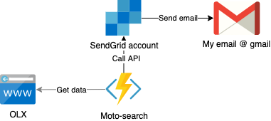

# azure-function-moto-search
The function to check if there is any new motorcycle sale announcement on my favorite "announcement integrator" which is very popular. If there is any new, I want to be notified by email. I am lazy so I have chosen the Azure infrastructure based on Azure Function.

 The function is triggered daily at 4 o'clock. If there is any new offer, the function is using SendGrid account to send an email. This solution will provide me the stable and cheap option to spare my time to only check the website if there is some new offer for my query. 